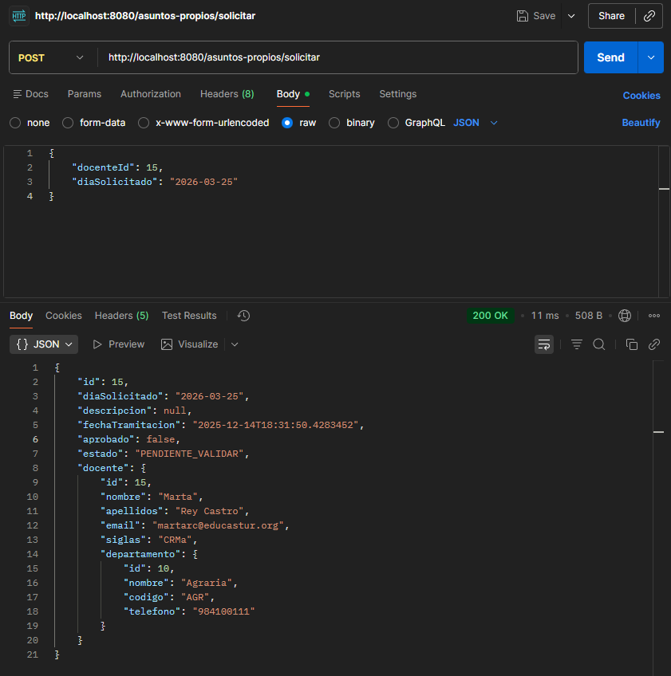

# Docentia

## 📄 Descripción del Proyecto

**DOCENTIA** es una aplicación desarrollada en **Spring Boot** para automatizar la gestión administrativa del personal docente de un centro de formación. El proyecto se centra en la implementación de una API RESTful que maneja dos funcionalidades críticas:

1. Función 1:
    
    **Gestión de Guardias:** Automatización del algoritmo de asignación de guardias ante ausencias, siguiendo criterios de departamento y número de guardias realizadas.
    
2. Función 2:
    
    **Gestión de Asuntos Propios:** Implementación de la lógica de negocio necesaria para la solicitud (UC2) y validación (UC5) de días libres, aplicando las reglas de prelación basadas en el tipo de funcionario, antigüedad y nota de oposición.
    

El código sigue una **Arquitectura de Capas** clara (Controller, Service, Repository, Model) y utiliza **DTOs** para asegurar una comunicación limpia y desacoplada entre la API y la lógica interna.

## ⚙️ Configuración Técnica

- **Framework :** Spring Boot
- **Persistencia:** Spring Data JPA + Hibernate
- **Estrategia de Desarrollo:** API RESTful
- **Base de Datos:** [MySQL]

## 🚀 Acceso a la API

La aplicación se ejecuta por defecto en el puerto **8080** y puede ser probada mediante cualquier cliente HTTP (como Postman) en la siguiente URL base:

`http://localhost:8080`

Aquí una tabla con todas las rutas posibles en la API, en conjunto con una indicación de cuales están ya implementadas y devuelven datos:

| **Tarea / Descripción** | **Puntos** | **Obligatorio** | Hecho | **Ruta Postman** |
| --- | --- | --- | --- | --- |
| **Estructura** correcta de los paquetes (controllers, services, model,...)  | 0.5 | **SÍ** | SÍ | No aplica |
| **Estilo codificación** (Spring / Java Standard)  | 0.5 | **SÍ** | SÍ | No aplica |
| **Uniformidad** en la nomenclatura de las rutas (`@RequestMapping`)  | 0.5 | **SÍ** | SÍ | No aplica |
| **Creación del modelo** (entidades + relaciones, incluyendo `JsonIgnore`)  | 2 | **SÍ** | SÍ | No aplica |
| **Creación de DTO** útil sobre una entidad | 1.5 | NO | SÍ | No aplica |
| **Creación de DTO** de más de una entidad útil  | 2 | NO | SÍ | No aplica |
| UC2. Solicitar día propio (`fecha`, `docente_id`)  | 1.25 | **SÍ** | SÍ | `POST /asuntos-propios/solicitar` |
| UC5. Validar días asuntos propios (`fecha`, `docente_id`, `aceptado`)  | 1.25 | **SÍ** | SI | `POST /asuntos-propios/validar` |
| UC6. Consultar días propios (`fecha`, `docente_id`)  | 1 | NO | SI | `GET /asuntos-propios/consultar` |
| **Obtener docentes ordenados por apellidos** | 1 | NO | NO | `GET...` |
| **Obtener docentes de un departamento** (`nombre departamento`)  | 1 | NO | NO | `GET...` |
| **Obtener número de profesores** (`código departamento`) | 1 | NO | NO | `GET...` |
| **Obtener días propios pendientes de disfrutar** (`id_docente`, fecha `>=hoy`) | 1 | NO | NO | `GET...` |
| **Obtener docente que más días propios ha disfrutado** | 1 | NO | NO | `GET...` |

## Consultas con Postman

### Solicitar día asuntos propios:

### Consultar día asuntos propios:

### Validar día de asuntos propios:

